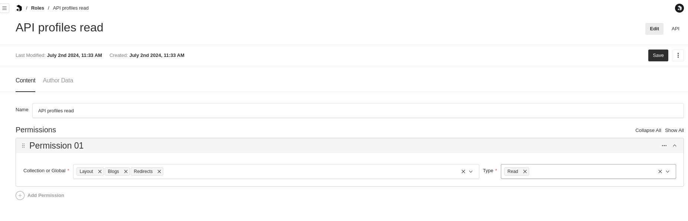
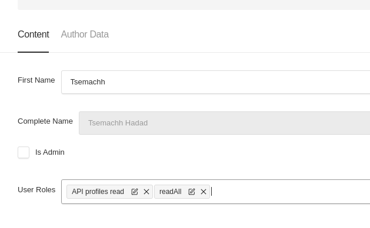

## [Authorization plugin](./src/index.ts)

We created a plugin which will enable flexibility in setting the roles
The Admin sets in the Roles collection any roles needed in the organization.
A role contains permissions, when each permission can contain:
Multiple globals and collections and the permission types (read /write) the admin allows for them

For example:



The Admin can set as many permissions it wants and as many as roles as well.

Then the Admin assigns each user its roles:


### The plugin does the following:

Collects all collections and globals for the permissions drop down.

Gos over all collections in the system and assigns them the access APIs according to the definition done by the Admin.

Sets the Cell display for createAt and updatedAt fields to use moment.js relation time

### Fields Configuration

The `roles` collection should have the following fields:

```javascript
fields: [
  {
    name: 'name',
    type: 'text',
    unique: true, // Ensures role names are unique
  },
  {
    name: 'permissions',
    saveToJWT: true, // Save this field to JWT so it can be accessed via `req.user`
    interfaceName: 'RolePermissions',
    type: 'array',
    access: {
      // Only admins can create or update a value for this field
      create: isAdminFieldLevel,
      update: isAdminFieldLevel,
    },
    fields: [
      {
        type: 'row', // Group fields in a row layout
        fields: [
          {
            name: 'entity',
            label: 'Collection or Global',
            type: 'select',
            hasMany: true,
            options: [], // Populated dynamically with collections and globals
            required: true,
            admin: {
              width: '70%',
            },
          },
          {
            name: 'type',
            label: 'Type',
            type: 'select',
            hasMany: true,
            options: [
              {
                label: 'Write',
                value: 'write',
              },
              {
                label: 'Read',
                value: 'read',
              },
              {
                label: 'Publish',
                value: 'publish',
              },
            ],
            required: true,
            admin: {
              width: '30%',
            },
          },
        ],
      },
    ],
  },
];
```

The `users` collection should have the following fields:

```javascript
        {
          name: 'isAdmin',
          type: 'checkbox',
          defaultValue: false,
          saveToJWT: true,
          access: {
            // Only admins can create or update a value for this field
            create: isAdminFieldLevel,
            update: isAdminFieldLevel,
          },
        },
        {
          name: 'isGeneratorUser',
          type: 'checkbox',
          defaultValue: false,
          saveToJWT: true,
          access: {
            // Only admins can create or update a value for this field
            create: isAdminFieldLevel,
            update: isAdminFieldLevel,
          },
        },
        {
        name: 'userRoles',
        type: 'relationship',
        saveToJWT: true,
        relationTo: 'roles', // Reference the 'roles' collection
        hasMany: true, // Allow multiple roles per user
        access: {
            // Only admins can create or update a value for this field
            create: isAdminFieldLevel,
            update: isAdminFieldLevel,
        },
        },
```
