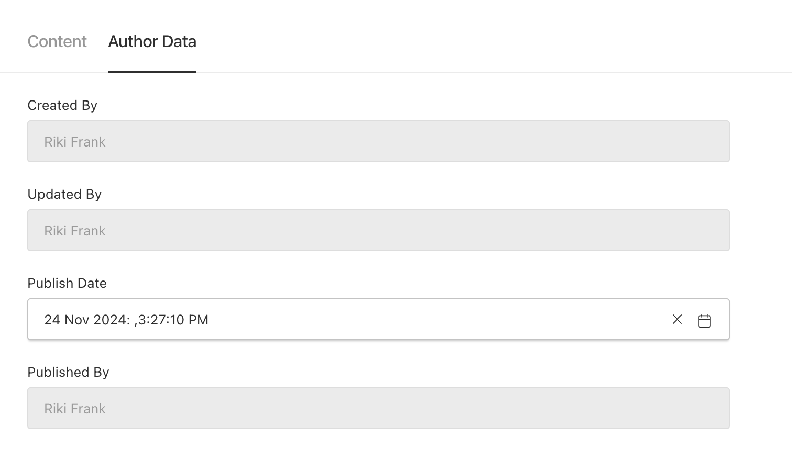
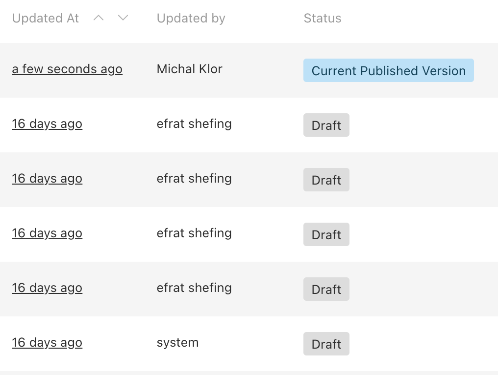

## [Author Info plugin](./src/index.ts)

- Payload 3.0 does not store authors informations, so we created this package to automatically store information about who created, updated and publish content, and this for all collections and globals. The package does add a new tab in the authoring user interface "Author Data".
- Payload 3.0 is storing the creation and modification date of each document's collections but does not store publication date. So this package aslo stores the most recent publish date.



### Setup

In order to use this authors-info plugin install it using your prefered node package manager, e.g:

`npm add @rikifrank/authors-info`

In the payload.config.ts add the following:

```typescript
plugins: [
    ...plugins,
    addAuthorsFields({
      excludedCollections: [],
      usernameField: 'fullName',
    }),
```

### Configuration

- `excludedCollections`: array of collections names to exclude

- `excludedGlobals`: array of globals names to exclude

- `usernameField`: name field to use from Users collection, 'user' by default


The dates are presented relatively using moment.js anywhere using CreatedAtCell type 

