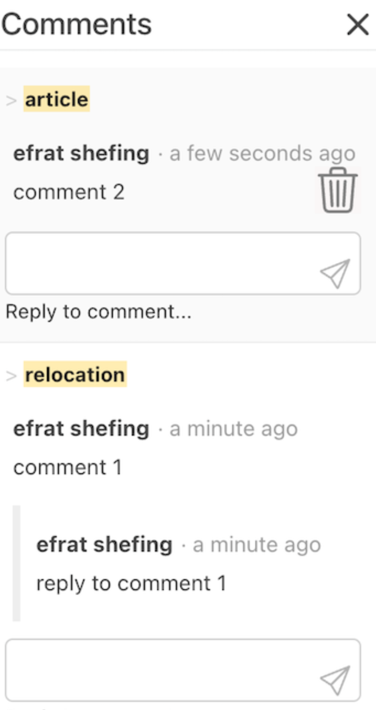
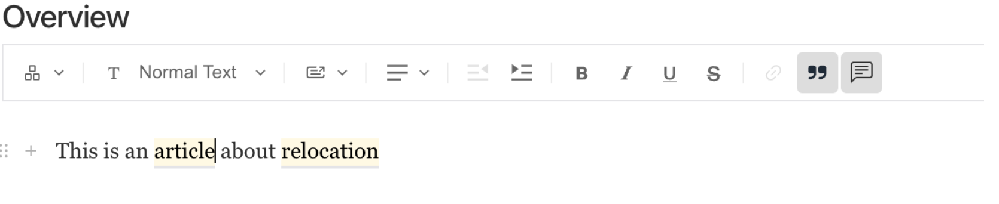

### Comments Plugin

This plugin allows users to add comments on text within a RichText field using Lexical.

The user can add a comment on selected text to start a discussion about this content:


Comments section is available on the right side of the screen and users can reply or delete comments



In addition, commented text has a mark

when clicking on the mark, it open the comments panel on the right side with focus on the current comment



### Setup

Install the plugin using your node package manager, e.g:

`npm install @shefing/comments`

In the payload.config.ts add the following:

```javascript
CommentsPlugin({
  excludedCollections: ['posts', 'media'], //array of collections names to exclude
  excludedGlobals: ['aboutus'], //array of collections names to exclude
});
```

### Collection Configuration

#### 1. Enable Comments in Your Collection

In the target collection, add this under admin:

```javascript
admin: {
  custom: {
    comments: true,
  },
},
```

#### 2. Configure the Rich Text Field

For the rich text field, add this editor configuration:

```javascript
import { commentFeature } from '@shefing/comments/feature';
fields: [
  {
    name: 'richText',
    label: 'Rich Text',
    type: 'richText',
    editor: lexicalEditor({
      features: ({}) => [FixedToolbarFeature(), commentFeature()],
    }),
  },
];
```
