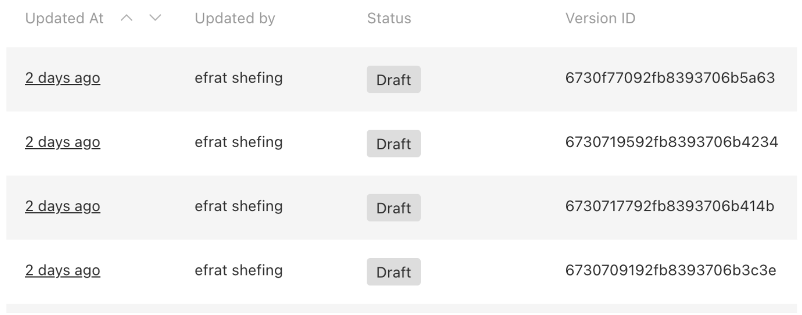

## [Custom Version View plugin](./src/index.ts)

We added some fields to the version view :

Updated At -using relative date
Updated by

For example:



### Setup

In order to use this Custom -Version- View plugin install it using your prefered node package manager, e.g:

`npm add @shefing/custom-version-view`

In the payload.config.ts add the following:

```typescript
plugins: [
    ...plugins,
    versionsPlugin({
      excludedCollections: []
    })
```
The updated by field in versions relies on the authors-info package.

### Configuration

- `excludedCollections`: array of collections names to exclude

- `excludedGlobals`: array of globals names to exclude

### Collection Configuration

To enable versions for a collection, you need to add the following configuration to the collection:

```javascript
versions: {
    drafts: true,
  }
```

