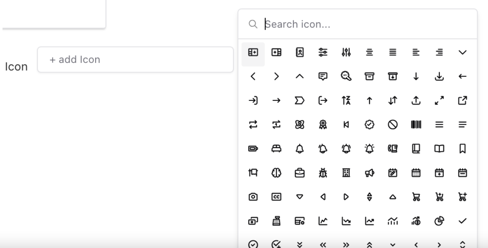

## [Icon select field ](./src/index.ts)

This plugin adds a custom Icon Select field to Payload CMS, utilizing the tailwind icon library for easy selection. Users can search or scroll through icons in the dropdown, with ShadCN UI integration for a seamless, modern experience.



### Setup

Install the plugin using your node package manager, e.g:

` npm install @shefing/icon-select`

In the collection add the following:

```typescript
import   { createIconSelectField }  from "@shefing/icon-select"

 fields: [ 
 createIconSelectField({ name: 'iconType', label: 'Select Icon' }),
 ]
```

To use this package, you need to install Tailwind CSS in your project.

